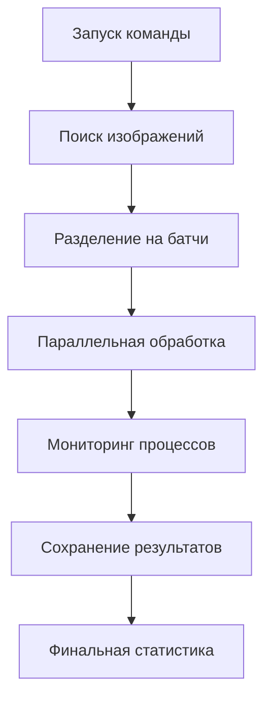

# 🖼️ ImagesCacheWarmupCommand - Команда для прогрева кеша изображений

## 📖 Оглавление
1. [Что это такое?](#что-это-такое)
2. [Как это работает?](#как-это-работает)
3. [Быстрый старт](#быстрый-старт)
4. [Подробное использование](#подробное-использование)
5. [Опции командной строки](#опции-командной-строки)
6. [Мониторинг и отладка](#мониторинг-и-отладка)
7. [Лучшие практики](#лучшие-практики)
8. [Устранение неисправностей](#устранение-неисправностей)

---

## 🎯 Что это такое?

**ImagesCacheWarmupCommand** - это Symfony команда для **прогрева кеша изображений**. Она оптимизирована для обработки больших объемов изображений (от тысяч до десятков тысяч).

### Зачем нужен прогрев кеша?
Когда пользователь впервые открывает страницу с изображением, LiipImagineBundle:
1. ✅ Загружает оригинальное изображение
2. ✅ Применяет фильтры (размер, качество и т.д.)
3. ✅ Сохраняет результат в кеш
4. ✅ Возвращает обработанное изображение

**Проблема:** Первый пользователь ждет дольше всех последующих!

**Решение:** Прогреваем кеш заранее, чтобы все изображения были готовы.

---

## 🏗️ Как это работает?

### Архитектура команды



### Основные компоненты:

#### 1. **Батчинг (Разделение на группы)**
```php
// Разделяем 1000 изображений на батчи по 50 штук
$batches = array_chunk($images, 50); // Получим 20 батчей
```

#### 2. **Параллельная обработка**
```php
// Запускаем до 4 процессов одновременно
$process1 = new Process(['php', 'bin/console', 'liip:imagine:cache:resolve', 'image1.jpg']);
$process2 = new Process(['php', 'bin/console', 'liip:imagine:cache:resolve', 'image2.jpg']);
// ... и т.д.
```

#### 3. **Мониторинг и управление**
- ✅ Отслеживание активных процессов
- ✅ Обработка завершенных процессов
- ✅ Управление памятью (gc_collect_cycles)
- ✅ Graceful shutdown (Ctrl+C)

---

## 🚀 Быстрый старт

### 1. Простой запуск
```bash
php bin/console app:images:cache:warmup
```

### 2. Проверить что будет обработано (без выполнения)
```bash
php bin/console app:images:cache:warmup --dry-run
```

### 3. Обработка с кастомными настройками
```bash
php bin/console app:images:cache:warmup --batch-size=100 --parallel=8
```

---

## 📋 Подробное использование

### Базовое использование

```bash
# Обработка всех изображений в public/img с фильтрами sm, md, md2, xl
php bin/console app:images:cache:warmup
```

### Продвинутое использование

```bash
# Обработка только определенных фильтров
php bin/console app:images:cache:warmup --filter=md --filter=xl

# Обработка изображений из конкретной папки
php bin/console app:images:cache:warmup --path=public/uploads/products

# Продолжение обработки с последнего места (если была прервана)
php bin/console app:images:cache:warmup --continue

# Детальный вывод с показом каждого обработанного файла
php bin/console app:images:cache:warmup --detailed
```

### Примеры для разных сценариев

#### Для разработки:
```bash
# Быстрая обработка с минимальными настройками
php bin/console app:images:cache:warmup --batch-size=10 --parallel=2
```

#### Для продакшена:
```bash
# Оптимизированная обработка большого количества изображений
php bin/console app:images:cache:warmup --batch-size=200 --parallel=8
```

#### Для тестирования:
```bash
# Проверить что будет обработано без реальной обработки
php bin/console app:images:cache:warmup --dry-run --batch-size=5
```

---

## ⚙️ Опции командной строки

| Опция | Короткая | Значение по умолчанию | Описание |
|-------|----------|----------------------|----------|
| `--batch-size` | `-b` | `50` | Количество изображений в одном батче |
| `--parallel` | `-p` | `4` | Максимальное количество параллельных процессов |
| `--dry-run` | `-d` | - | Показать план обработки без выполнения |
| `--continue` | `-c` | - | Продолжить с последнего обработанного изображения |
| `--filter` | `-f` | `sm,md,md2,xl` | Какие фильтры применять (можно несколько) |
| `--path` | - | `public/img` | Путь к папке с изображениями |
| `--detailed` | - | - | Детальный вывод с показом каждого файла |

### Подробное описание опций:

#### `--batch-size` (Размер батча)
```bash
# Маленькие батчи = меньше памяти, но медленнее
php bin/console app:images:cache:warmup --batch-size=10

# Большие батчи = быстрее, но больше памяти
php bin/console app:images:cache:warmup --batch-size=200
```

#### `--parallel` (Параллельные процессы)
```bash
# Для слабых серверов
php bin/console app:images:cache:warmup --parallel=2

# Для мощных серверов
php bin/console app:images:cache:warmup --parallel=16
```

#### `--filter` (Фильтры)
```bash
# Только маленькие изображения
php bin/console app:images:cache:warmup --filter=sm

# Только средние и большие
php bin/console app:images:cache:warmup --filter=md --filter=md2 --filter=xl

# Все фильтры (по умолчанию)
php bin/console app:images:cache:warmup
```

#### `--path` (Путь к изображениям)
```bash
# Обработка изображений из разных папок
php bin/console app:images:cache:warmup --path=public/uploads/products
php bin/console app:images:cache:warmup --path=public/media/gallery
```

---

## 📊 Мониторинг и отладка

### Что показывает команда во время работы:

```
📸 Найдено изображений: 1000
🔄 Всего операций: 4000
📦 Батчей: 20 (по 50 изображений)
⚡ Параллельных процессов: 4
🎯 Фильтры: sm, md, md2, xl

 4000/4000 [============================] 100%  45m 23s/45m 25s  128.0 MiB
```

### Логи

Все действия записываются в лог-файл:
```
📁 var/log/image_cache_warmup.log
```

Пример содержимого лога:
```
[2025-01-15 10:30:15] Starting cache warmup for 1000 images
[2025-01-15 10:30:20] Processing batch 1/20
[2025-01-15 10:35:10] Processing batch 10/20
[2025-01-15 11:15:30] Completed: 4000 processed, 0 errors
```

### Прогресс выполнения

Команда сохраняет прогресс в файле:
```
📁 var/cache/image_cache_progress.json
```

Это позволяет:
- ✅ Возобновить обработку с `--continue`
- ✅ Отследить сколько уже обработано
- ✅ Понять на каком этапе была прервана обработка

### Детальный вывод

```bash
php bin/console app:images:cache:warmup --detailed
```

Показывает каждый обработанный файл:
```
✅ img/product1.jpg [sm]
✅ img/product1.jpg [md]
✅ img/product1.jpg [md2]
❌ img/broken.jpg [xl] - Failed to load image
✅ img/product2.jpg [sm]
...
```

---

## 💡 Лучшие практики

### 1. Выбор размера батча

```bash
# Для серверов с 2GB RAM
php bin/console app:images:cache:warmup --batch-size=50

# Для серверов с 8GB RAM
php bin/console app:images:cache:warmup --batch-size=200

# Для серверов с 32GB+ RAM
php bin/console app:images:cache:warmup --batch-size=500
```

### 2. Настройка параллелизма

```bash
# Правило: CPU cores × 1.5
# Для 4-ядерного процессора
php bin/console app:images:cache:warmup --parallel=6

# Для 8-ядерного процессора
php bin/console app:images:cache:warmup --parallel=12
```

### 3. Когда запускать прогрев

#### В разработке:
```bash
# После добавления новых изображений
php bin/console app:images:cache:warmup --dry-run
php bin/console app:images:cache:warmup
```

#### На продакшене:
```bash
# Ночью, когда нагрузка минимальная
# Через cron или планировщик задач
0 2 * * * /path/to/project/bin/console app:images:cache:warmup --batch-size=200 --parallel=8
```

### 4. Мониторинг ресурсов

```bash
# Следите за использованием памяти
php bin/console app:images:cache:warmup --batch-size=100 --parallel=4

# Если памяти не хватает - уменьшите батч
php bin/console app:images:cache:warmup --batch-size=50 --parallel=2
```

---

## 🔧 Устранение неисправностей

### Проблема: "Изображения не найдены"

**Причина:** Неправильный путь к изображениям

**Решение:**
```bash
# Проверить правильный путь
php bin/console app:images:cache:warmup --path=public/uploads

# Проверить содержимое папки
ls -la public/uploads/
```

### Проблема: "Memory exhausted"

**Причина:** Слишком большой батч или много параллельных процессов

**Решение:**
```bash
# Уменьшить размер батча
php bin/console app:images:cache:warmup --batch-size=25 --parallel=2

# Увеличить память PHP (php.ini)
memory_limit = 512M
```

### Проблема: "Too many open files"

**Причина:** Слишком много параллельных процессов

**Решение:**
```bash
# Уменьшить количество параллельных процессов
php bin/console app:images:cache:warmup --parallel=2

# Или увеличить лимит открытых файлов
ulimit -n 4096
```

### Проблема: Команда зависает

**Причина:** Один из процессов завис

**Решение:**
```bash
# Прервать выполнение Ctrl+C
# Проверить логи на ошибки
tail -f var/log/image_cache_warmup.log

# Продолжить с места остановки
php bin/console app:images:cache:warmup --continue
```

### Проблема: Кеш не создается

**Причина:** Неправильные права на папку cache

**Решение:**
```bash
# Проверить права на папку
ls -la public/media/cache/

# Исправить права
chmod -R 755 public/media/cache/
chown -R www-data:www-data public/media/cache/
```

### Проблема: Медленная обработка

**Причина:** Неоптимальные настройки

**Решение:**
```bash
# Проверить текущие настройки
php bin/console app:images:cache:warmup --dry-run

# Оптимизировать
php bin/console app:images:cache:warmup --batch-size=100 --parallel=8

# Проверить использование CPU/RAM
top
htop
```

---

## 📚 Дополнительные материалы

### Связанные команды:

```bash
# Очистить весь кеш изображений
php bin/console liip:imagine:cache:remove

# Проверить статус кеша
php bin/console liip:imagine:cache:resolve --dry-run

# Очистить кеш конкретного фильтра
rm -rf public/media/cache/md2/
```

### Конфигурация LiipImagine:

```yaml
# config/packages/liip_imagine.yaml
liip_imagine:
    driver: "gd"  # или "imagick"
    cache: default
    filter_sets:
        sm:
            quality: 50
            filters:
                thumbnail:
                    size: [150, 150]
                    mode: inset
```

### Cron для автоматического прогрева:

```bash
# Еженедельно по воскресеньям в 2:00
0 2 * * 0 /path/to/project/bin/console app:images:cache:warmup --batch-size=200 --parallel=8

# Ежедневно в 1:00 для папки с новыми изображениями
0 1 * * * /path/to/project/bin/console app:images:cache:warmup --path=public/uploads/daily
```

---

## 🎯 Заключение

**ImagesCacheWarmupCommand** - это мощный инструмент для оптимизации производительности веб-приложения с большим количеством изображений.

### Ключевые преимущества:
- 🚀 **Высокая производительность** благодаря параллельной обработке
- 💾 **Эффективное использование памяти** с батчингом
- 🔄 **Отказоустойчивость** с возможностью возобновления
- 📊 **Детальный мониторинг** прогресса и статистики
- 🛠️ **Гибкая настройка** под разные сценарии использования

### Для начинающих разработчиков:
1. **Начните с dry-run:** `php bin/console app:images:cache:warmup --dry-run`
2. **Тестируйте на малом объеме:** `--batch-size=10 --parallel=2`
3. **Следите за логами:** `tail -f var/log/image_cache_warmup.log`
4. **Используйте `--continue`** если обработка прервалась

### Для опытных разработчиков:
- Настраивайте параметры под характеристики сервера
- Интегрируйте в CI/CD пайплайн
- Мониторьте производительность и оптимизируйте

**Happy coding! 🚀**
